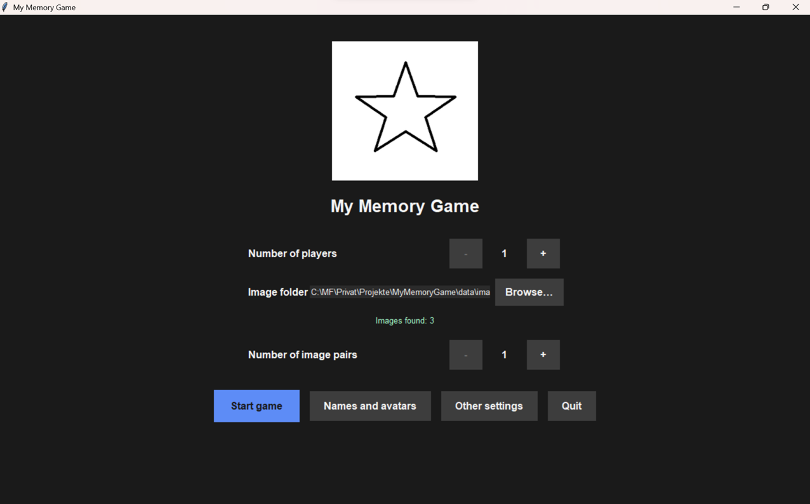
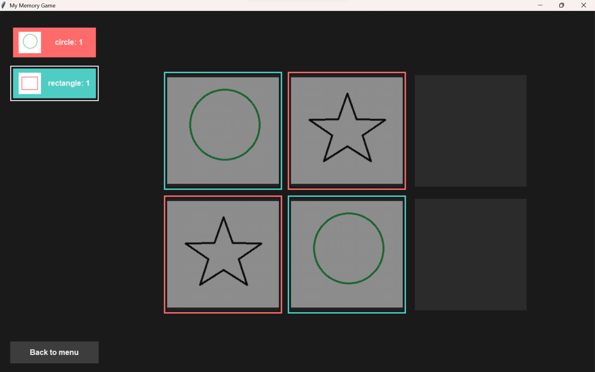

# My Memory Game

A customizable memory card game built with Python and Tkinter, featuring multilingual support and configurable settings.




## Features

- **Customizable**: Configure images (e.g., use your family pictures), sounds ("hurray" from your friend in WhatsApp), and avatars
- **Multiplayer Support**: Up to 6 players with individual scoring and avatars
- **Multilingual**: Supports German, English, and Spanish. Extend it yourself by simply adding your language in the folder `locale`!
- **Sound Effects**: Optional audio feedback for matches
- **Image Gallery**: Review matched images after completing the game

## Quick Start

Run the automated installer that handles everything for you, either by double click or execution in the terminal

```shell
install.bat
```

and launch the game from your desktop with the created shortcut.

## Uninstallation

To cleanly remove the Memory Game installation:

```shell
uninstall.bat
```

## Configuration

The game behavior can be customized through the `config.yaml` file:

### Key Settings

- **`language`**: Set to `"de"`, `"en"`, or `"es"`
- **`title.text`**: Custom game title
- **`title.image.path`**: Path to title image
- **`media.images.folder`**: Default image folder
- **`media.sounds.folder`**: Sound effects folder
- **`media.avatars.folder`**: Player avatars folder
- **`ui.font`**: Customize font family and sizes

### Example Configuration

```yaml
language: en
title:
  text: "My Memory Game"
  image:
    path: 'data/avatars/star.png'
    max_width: 520
    max_height: 220
shortcut:
  image: 'data/avatars/star.png'
layout:
  bottom_border_fraction: 0.1
media:
  sounds:
    folder: 'data/sounds'
  avatars:
    folder: 'data/avatars'
  images:
    folder: 'data/images'
ui:
  font:
    title:
      size: 20
      weight: bold
    emphasis:
      size: 12
      weight: bold
    body:
      size: 10
      weight: normal
```

## Controls

- **Click cards** to flip them
- **Match pairs** to score points
- **Review Gallery** button appears after game completion
- **Menu navigation** for settings and player configuration

## Tips

- Organize images in subfolders for better management
- Use square images for best card appearance
- Enable sounds for enhanced gameplay experience
- Customize player avatars for personalization
